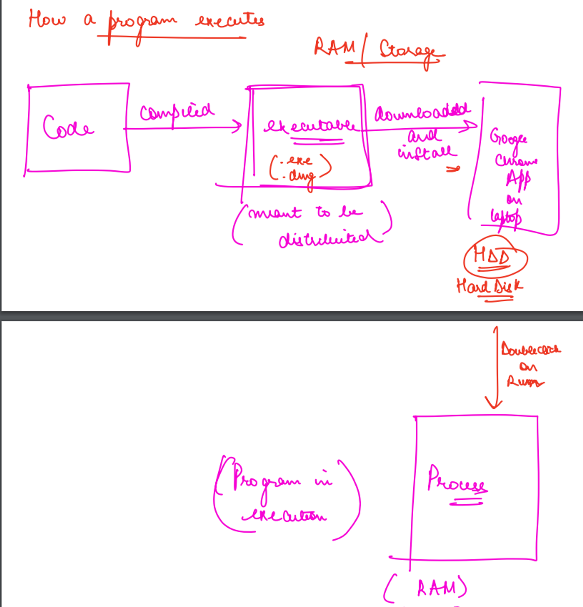
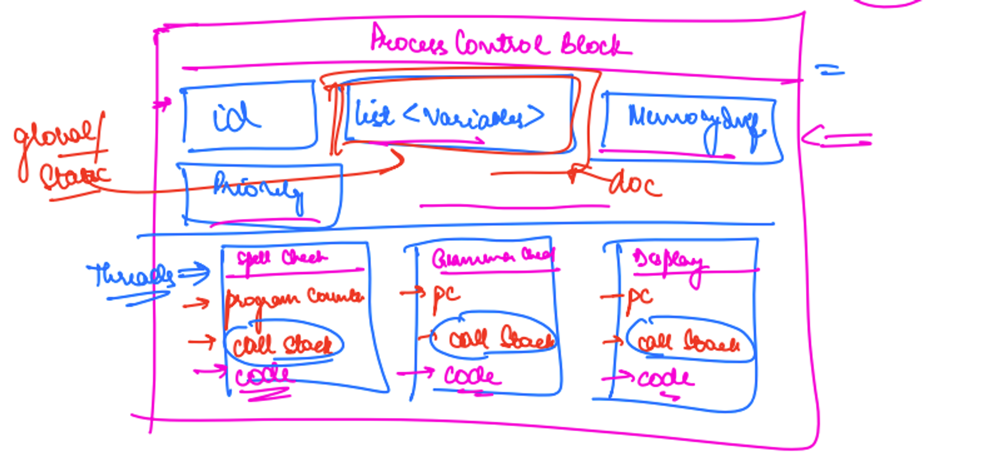
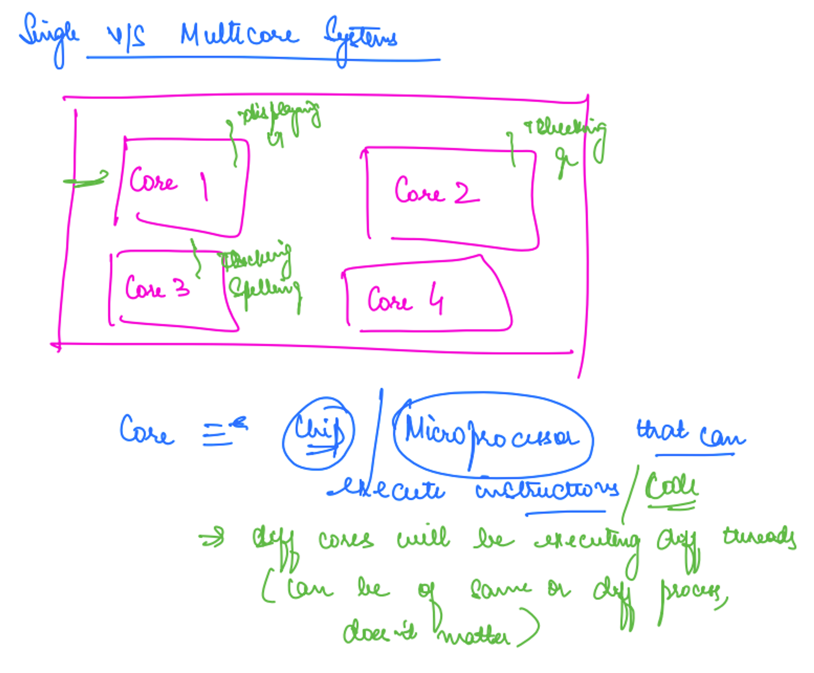
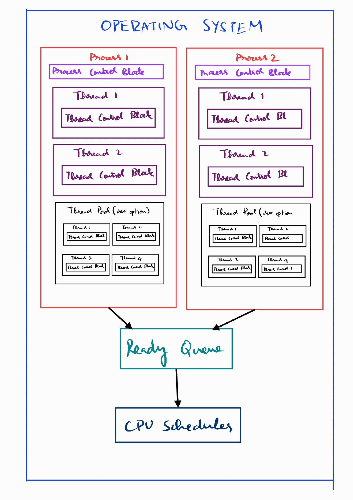
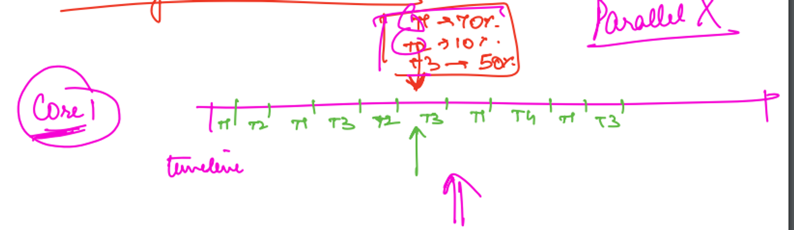
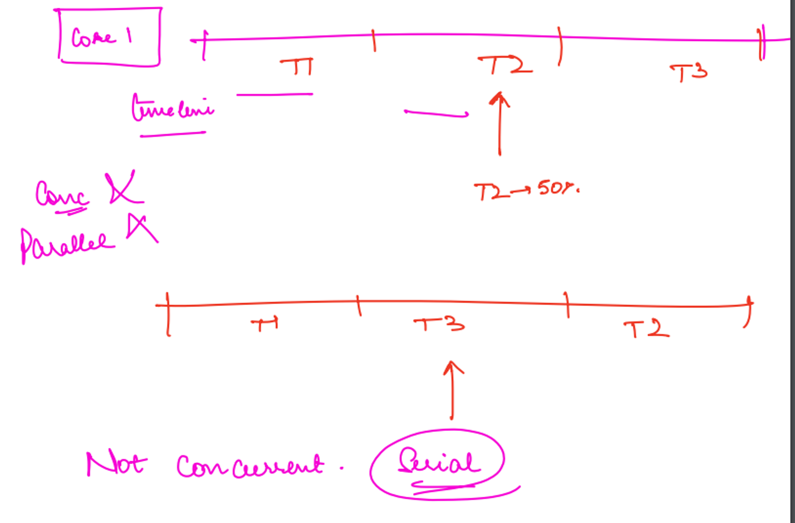
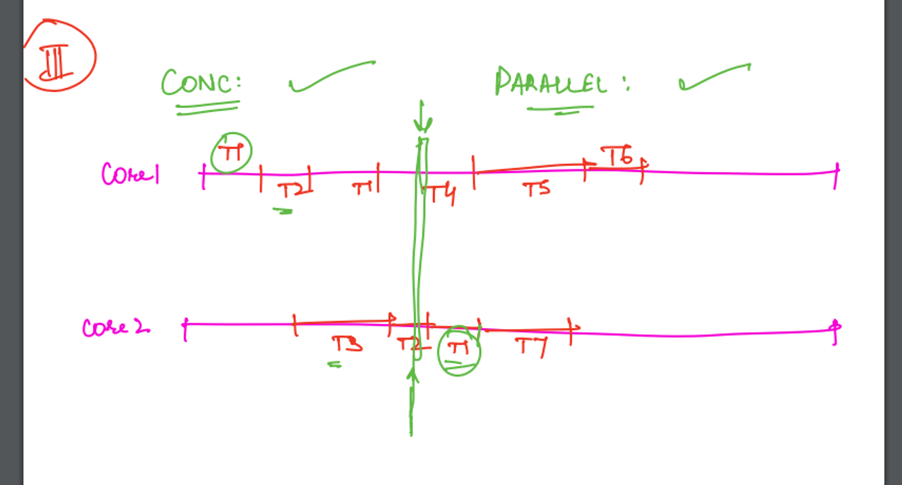
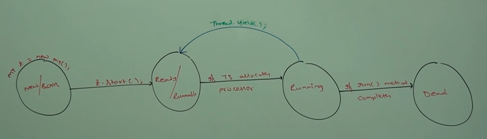
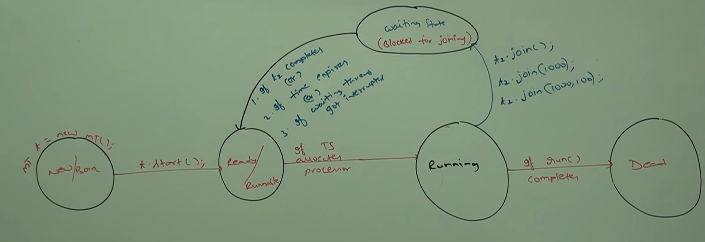

# Multitasking

## What is multitasking?

Multitasking refers to the ability of a system to execute multiple tasks simultaneously.

## Types of Multitasking

1. **Process-Based Multitasking:**
   - Process-based multitasking involves running multiple independent processes simultaneously. 
   - Each process has its own memory space, resources, and program counter. 
   - The operating system allocates CPU time to each process, allowing them to execute concurrently. 
   - Examples of operating systems that support process-based multitasking include Unix/Linux, Windows, and macOS. 
   - Process-based multitasking provides strong isolation between processes, but switching between processes may incur higher overhead due to context switching.   
   - Real-Life Example:
      - Typing a Java program in an editor while listening to music.
      - Screen sharing from Google Meet while working in an IDE or another application.

2. **Thread-Based Multitasking:**
   - Thread-based multitasking involves running multiple threads within a single process. 
   - Threads share the same memory space and resources, including code, data, and open files. 
   - Threads within a process can execute concurrently and share resources more efficiently compared to processes. 
   - The operating system's scheduler allocates CPU time to individual threads within a process. 
   - Thread-based multitasking is commonly used for tasks that can be parallelized, such as handling multiple client connections in a server application or performing background tasks while the main thread remains responsive. 
   - Examples of programming languages and platforms that support thread-based multitasking include Java, C/C++, and .NET.
   - Real-Life Examples:
     - Dividing a large program into segments and executing them concurrently.
     - Using Spotify to listen to music and download songs simultaneously.

--- 

# How a program executes?

## How does an app work on a phone or computer?

### Flow Diagram


> Code → Executable file → Program (in storage) → Process (in RAM)



**Code**: A Code consists of human-readable text written by programmers in a programming language such as Python, Java, and so on. It’s not executed by the computer directly.

**Executable file:** The code is translated into an executable file. This file contains instructions and data that a computer can understand. This translation is done by a program called a compiler or interpreter, depending on the programming language.

**Program in Storage**: The executable file is stored on the computer storage like a Hard Disk or SSD.

**Process in RAM**: A "process" is like a separate program running on a computer. When you run a program, it's stored temporarily in RAM, which is much faster than regular storage. This helps the computer execute the program quickly. While the program runs, the CPU fetches what it needs from RAM to keep things moving smoothly. So, during execution, the CPU mainly talks to RAM, not to storage devices.

## Clock Speed

1. Clock speed is measured in gigahertz (GHz), which indicates how quickly the CPU can process instructions and perform tasks.
2. A CPU (Central Processing Unit) with a clock speed of 2.9GHz means that it can execute 2.9 billion cycles (or operations) per second.

---

# What happens in the RAM during program execution?

## Process Control Block

1. A Process Control Block (PCB), also known as a Task Control Block (TCB), is a data structure used by the operating system to manage and store information about a specific process or task.
2. Each active process in a computer system has its own PCB associated with it.
3. It's like a to-do list for the computer to keep track of what each program is doing and manage them effectively.

### Real-Life Example

Imagine you are a chef in a busy kitchen, and you have multiple dishes cooking on the stove. Each dish represents a different program or task. To manage everything efficiently, you have a clipboard with sheets of paper, and each sheet is labeled with the name of a dish and has important information about it.

- **Dish Name**: This is like the name of the program or task.
- **Cooking Status**: It tells you if the dish is currently cooking, simmering, or done.
- **Cooking Time**: How long you've been cooking the dish.
- **Ingredients Needed**: What ingredients are required for that dish.
- **Next Steps**: The next actions you need to take for that dish, like adding seasoning or stirring.

So, for each dish (or program), you have one of these sheets (or PCBs) to keep track of its status, time, ingredients, and what needs to happen next. This way, you can efficiently manage all the dishes (or programs) in your kitchen (or computer) and ensure everything gets done correctly and on time.

## Information stored in a PCB

1. **Process ID (PID)**: A unique identifier of the process within the operating system.
2. **Process State**: Indicates whether the process is running, ready to run, blocked, or terminated.
3. **Program Counter (PC)**: The memory address of the next instruction to be executed within the process. This allows the operating system to resume the process from where it left off when it's scheduled to run.
4. **CPU Registers**: CPU Registers are small, high-speed storage located with CPU. They are used to store and manipulate data temporarily during program execution. The PCB does not directly contain CPU registers. The values of CPU registers (e.g., general-purpose registers, program status registers) are saved in the PCB when the process is not running. This allows the process to maintain its state when it's not executing.
5. **Priority Information**: The priority of the process, which can be used by the operating system's scheduler to determine the order in which processes are scheduled for execution.
6. **Memory Management Information**: Information about the memory allocation of the process, including pointers to the process's code, data, and **stack segments**.
7. **Open File Pointers**: A list of files and resources that the process has opened or is currently using.
8. **Accounting Information: Information used for process accounting like CPU time used, memory used, start time, etc.**
9. **Parent-Child Relationship**: Information about the parent process and any child processes created by this process.
10. **Signal and Interrupt Handling**: Information about the signals and interrupts associated with the process, including how the process should respond to them.


> ❗ Thread Control Blocks (TCBs) and Process Control Blocks (PCBs) are related concepts used by operating systems to manage and control processes and threads, but they serve different purposes and contain different information. Each thread within a process typically has its own TCB, and TCBs store information specific to thread management, such as thread state, program counter, CPU registers, and thread-specific data.

---

# How can one application do multiple tasks parallelly at the same time?

- How does Microsoft Word manage to perform tasks like spell checking, grammar checking, and displaying content all at the same time?

> A picture of a sample code block of Microsoft Word (not the original Microsoft Word code block )

- Within a single process, THREADS are used to achieve concurrency(performing multiple tasks simultaneously).
- Threads allow different parts of a program to run concurrently, potentially improving performance and responsiveness.
 
---

# Threads

> 🗣 The CPU doesn't directly run processes but rather executes threads.

## What is thread?

- A Thread is the smallest unit of CPU execution.
- Think of a thread as an independent bundle of code that we provide to the CPU to execute.
- Multiple threads can exist within a single process.
- Threads within the same process share memory space and resources, facilitating direct access to shared data and global variables, enhancing efficiency.
- Switching between threads is generally simpler and more efficient than switching between processes due to threads sharing the same memory space and resources within a process. This shared context allows for faster context switching and resource management compared to the overhead involved in switching between entirely separate processes.
- There is no process without a thread because the CPU only executes threads.
- Each thread possesses its own Program Counter, stack, and registers, ensuring independent execution. Threads can be scheduled to run in any order and can be interrupted and resumed as needed.
- We have both multi-threaded and single-threaded applications, each offering distinct advantages depending on the requirements and constraints of the application.



A visual representation of PCB and threads in an application.

## Who creates thread?
1. **Creating Threads by the Developer**:
   Java provides a built-in mechanism for creating and managing threads through its `java.lang.Thread` class and the `java.util.concurrent` package. Developers can explicitly create threads in Java by instantiating the `Thread` class and passing a `Runnable` object to it. Here's an example:

    ```java
    // Define a Runnable task
    Runnable myRunnable = () -> {
        // Code to be executed in the new thread
        System.out.println("This is a thread running.");
    };
    
    // Create a new thread and start it
    Thread thread = new Thread(myRunnable);
    thread.start();
    
    ```

   In this example, a new thread is explicitly created by the developer to run the code specified in the `run()` method of the `Runnable` object.

2. **Automatically by the Application**:
   In some Java applications or frameworks, threads are created and managed automatically in the background to perform tasks concurrently. For example, in a Java web application, a servlet container like Tomcat may create and manage threads to handle incoming HTTP requests concurrently. Developers often don't need to create threads themselves in such cases; the application framework handles it for them.

3. **By the Operating System**:
   Threads are like small workers that the computer's operating system automatically hires to help with tasks in a program. The operating system handles the process of creating these workers, giving them what they need to get the job done. As a programmer, you don't need to worry about creating threads yourself; the operating system takes care of it behind the scenes, allowing your program to run smoothly with multiple tasks happening at once.# Single vs. Multicore System

---

# CPU Scheduler:

- The CPU scheduler is part of the operating system.
- It determines which processes are allocated CPU time and in what order.
- The CPU scheduler's primary goal is to maximize CPU utilization, throughput, and responsiveness while minimizing latency and overhead.
- It uses various scheduling algorithms such as round-robin, shortest job next, and priority scheduling to allocate CPU time to processes.
- The CPU scheduler operates at the process level, managing the execution of entire processes.

# Thread Scheduler:

- The thread scheduler is part of the Java Virtual Machine (JVM).
- It manages the execution of threads within a Java program.
- The thread scheduler determines the order in which threads are executed on the available CPU cores.
- Unlike the CPU scheduler, which operates at the process level, the thread scheduler operates at the thread level, managing individual threads within a process.
- The thread scheduler's decisions may be influenced by factors such as thread priority, synchronization, and concurrency control mechanisms.
---

# Single-core vs. Multicore System
- A CPU does not directly run the code rather the individual core within the CPU executes the code.
- The core is nothing but a chip inside the CPU.
- Each core within the CPU can execute a different thread, which can belong to the same or a different process.



## In single-core processor

- A process will have multiple tasks to execute but the CPU typically executes one task at a time. So, how multiple tasks are performed? Multi-tasking is achieved by **“Context switching”** with the help of a CPU scheduler.
- The CPU scheduler is an integral part of the operating system.
- The CPU scheduler operates on the **”ready queue”,** which is a data structure maintained by the operating system to store processes or threads that are ready to execute.
- **CPU scheduler also knows about the core of the CPU and it controls what thread to be assigned to what core at what time and keeps switching between them.**
- A single-core processor can execute only one task at a time. However, it can switch between different tasks so quickly that it creates the illusion of multitasking.

## In multi-core Processor

- The points mentioned above are also applicable to multi-core processors. The key distinction is that in multi-core processors, threads are distributed across multiple cores, allowing multiple threads to run in parallel.

---

# Thread Pool

- A thread pool is a pool of pre-initialized threads that are kept alive and ready to execute tasks.
- The primary purpose of a thread pool is to manage and reuse a fixed number of threads to execute tasks efficiently.
- The use of a thread pool is a design choice made by developers to manage and reuse threads efficiently in concurrent applications.
- Not all threads in a process need to be part of the thread pool.

---

# Visual Representation (important)



---

# Concurrency vs. parallelism (popular interview question)

## **Concurrent system**

- At one point in time, how many tasks can be done by the CPU? **One**
- At one point in time, how many tasks can be in different stages of execution by the CPU? **Many**
- **At particular times multiple tasks can be at different stages of execution.**



## **Serial System**

- At one point in time, how many tasks can be done by the CPU? **One**
- At one point in time, how many tasks can be in different stages of execution by the CPU? **One**
- **A serial system is where one task is pricked only after completing before task.**


## **Parallelism**

- At one point in time, how many tasks can be done by the CPU? **Many**
- At one point in time, how many tasks can be in different stages of execution by the CPU? **Many**
- **A system where multiple tasks are being done at the same time.**
- This can happen only in the multi-core system.



---

# Context Switching

- When the CPU switches task 2 things happen:
    - current task is saved
    - The next task to be done is loaded
- When the CPU scheduler switches from executing one process to another, it performs a context switch. This involves saving the state of the currently running process (e.g., CPU registers, program counter) and restoring the state of the next process to run. Context switching is a crucial operation for multitasking and multithreading.
- Context switching takes time so it should occur in an optimal balance – not too frequently and not too infrequently. This balance ensures efficient CPU usage and a smooth user experience.
- If context switching happens too frequently, it can lead to high CPU utilization and inefficiency. On the other hand, if it occurs infrequently, the user experience may suffer due to slower responsiveness.

---

# How to design a Multithreaded program?

- By Implementing Runnable
- By extending Thread Class

>❗ Don’t think in terms of what threads you want to create rather think in terms of which task you can execute in parallel.

---

# By Implementing Runnable

## HelloWorld printer (Problem)

**Problem Statement**

Write a HelloWorld program that executes in a separate thread from the main thread.

**Steps**

1. For every task that should be executed in parallel, design a class dedicated to that task. The class's name should be a descriptive noun that reflects the purpose of the task it performs.

    ```java
    public class HelloWorldPrinter {
    
    }
    ```

2. The previously mentioned class should implement an interface named 'Runnable’.

    ```java
    /*The Runnable interface should be implemented by any class whose instances are intended to be executed by a thread. 
    The class must define a method of no arguments called run.*/
    /*It is a functional interface introduced in Java to facilitate multithreading. */
    /*Runnable provides the means for a class to be active while not subclassing Thread*/
    public class HelloWorldPrinter implements  Runnable{
    
    }
    ```

3. The class should implement the 'run()' method from the 'Runnable' interface.

    ```java
    public class HelloWorldPrinter implements  Runnable{
        public void run(){
            System.out.println("Hello World");
        }
    }
    ```

   Here's the signature of the **`Runnable`** interface:

    ```java
    /*The 'Runnable' interface contains a single abstract method called 'run()' 
    which must be implemented by any class which implements the interface. */
    public interface Runnable {
    		/* The run method represent the code that execute when the thread is started */
        public abstract void run();
    }
    ```

4. To initiate a new thread, instantiate the class from where you wish to start it. In this case, we want to start a thread from the 'main' method by creating an instance of 'HelloWorldPrinter'.

    ```java
    public class Main {
        public static void main(String[] args) {
            HelloWorldPrinter hwp = new HelloWorldPrinter();
    
        }
    }
    ```

5. Now pass the instance that needs to run separately to an object of the 'Thread' class.

    ```java
    public class Main {
        public static void main(String[] args) {
            HelloWorldPrinter hwp = new HelloWorldPrinter();
            Thread thread = new Thread(hwp);
        }
    }
    ```

6. Start the thread.

    ```java
    public class Main {
        public static void main(String[] args) {
            HelloWorldPrinter hwp = new HelloWorldPrinter();
            Thread thread = new Thread(hwp);
            thread.start();
        }
    }
    ```


> 🔑 Threads are independent and run in parallel.

*Main.java*

```java
public class Main {
    public static void main(String[] args) {
        HelloWorldPrinter hwp = new HelloWorldPrinter();
        Thread thread = new Thread(hwp);
        thread.start();
				//"Thread.currentThread().getName()" will return thread name.
        System.out.println("Main thread is active. " + "Thread Name: " + Thread.currentThread().getName());
    }
}
```

*HelloWorldPrinter.java*

```java
public class HelloWorldPrinter implements Runnable{
    public void run(){
        for(int i = 0; i < 1000; i++)
            System.out.println("Count " + i + ": Hello World from " + Thread.currentThread().getName());
    }
}
```

*Output: The output can be of any order since both threads run in parallel.*

```
*//Output 1*
Count 0: Hello World from Thread-0
Count 1: Hello World from Thread-0
Count 2: Hello World from Thread-0
Main thread is active. Thread Name: main

*//Output 2*
Count 0: Hello World from Thread-0
Count 1: Hello World from Thread-0
Main thread is active. Thread Name: main
Count 2: Hello World from Thread-0

*//Output 3*
Count 0: Hello World from Thread-0
Main thread is active. Thread Name: main
Count 1: Hello World from Thread-0
Count 2: Hello World from Thread-0
```


Visual representation of how the program runs in parallel.


## What does thread class internally look like? (a rough code)

```java
Class Thread(){
	runnable x;
	Thread(runnable r){
		x = r;
	}
	start(){
		//tells OS to create a new thread
		//run() method of task is executed
		//ask OS to delete the thread
	}
}
```

---

# By extending Thread Class

**Problem Statement**

Write a Java program that creates and starts a new thread by extending the Thread class.

**Steps**

1. For every task that should be executed in parallel, design a class dedicated to that task. The class's name should be a descriptive noun that reflects the purpose of the task it performs.

    ```java
    public class HelloWorldPrinter {
    
    }
    ```
2. The previously mentioned class should extend the 'Thread' class.

    ``` java
    /*Extending the Thread class allows the class to be directly executed as a thread.*/
   public class HelloWorldPrinter extends Thread {

   }
    ```

3. The class should override the 'run()' method from the 'Thread' class.

    ```java
    public class HelloWorldPrinter extends Thread {
        public void run(){
            System.out.println("Hello World");
        }
   }
    ```

4. To initiate a new thread, instantiate the class from where you wish to start it. In this case, we want to start a thread from the 'main' method by creating an instance of 'HelloWorldPrinter'.

    ```java
    public class Main {
        public static void main(String[] args) {
            HelloWorldPrinter hwp = new HelloWorldPrinter();
    
        }
    }
    ```

5. Now simply start the thread by calling the 'start()' method on the object of the class.
    ```java
    public class Main {
        public static void main(String[] args) {
            HelloWorldPrinter hwp = new HelloWorldPrinter();
            hwp.start();
        }
    }
    ```

---

# .start() and .run()

**1. `.start()`:**
- The `.start()` method is used to begin the execution of a new thread.
- When invoked, it allocates system resources, initializes the thread, and calls the `run()` method of the thread in a separate execution context.
- It allows the thread to run concurrently with other threads in the program.
- It's essential to call `.start()` to initiate a new thread. Directly invoking the `run()` method won't create a new thread; instead, it executes the code synchronously in the current thread.

**2. `.run()`:**
- The `.run()` method contains the code that defines the behavior of the thread.
- It's the entry point for the logic that you want the thread to execute.
- When invoked directly (not through `.start()`), it runs synchronously in the current thread's context.
- Invoking `.run()` directly doesn't create a new thread; it simply executes the code sequentially in the calling thread.
- It's typically overridden by subclasses of `Thread` or implemented by classes that implement the `Runnable` interface.

--- 

# Overloading the run() method

- Overloading the `run()` method in Java threads is feasible; however, the `start()` method of the `Thread` class inherently invokes the no-argument `run()` method.
- If an overloaded version of the `run()` method exists in the class, it must be explicitly called like any other method, as the `start()` method won't automatically invoke it.
- This implies that while multiple `run()` methods can exist due to overloading, only the no-argument version will be implicitly invoked by `start()`. Any other variants must be invoked explicitly to execute.

--- 

# Overriding of start() method

- Overriding start() method bypasses the thread creation mechanism provided by the Thread class.
- Instead of spawning a new thread, the overridden start() method behaves like any other method, executing in the context of the current thread.
- To maintain the intended behavior of creating new threads, it's best to refrain from overriding the start() method in most cases.
- If it's absolutely necessary to override start() while retaining the original behavior, use super.start() within the overridden method to invoke the superclass implementation and create a new thread as intended.

---

# Life cycle of Thread

The life cycle of a thread in Java can be described in several stages:

1. **New**: The thread is in this state when it has been created but has not yet started. An instance of the `Thread` class has been created, but the `start()` method has not been called.

2. **Runnable**: In this state, the thread is ready to run, and the `start()` method has been called. However, the thread scheduler has not selected it to be the running thread yet. When the thread gets CPU time, it transitions to the running state.

3. **Running**: The thread is currently being executed by the CPU. It is actively performing its task or executing the code in its `run()` method.

4. **Blocked/Waiting**: In this state, the thread is temporarily inactive. It might be waiting for a resource, such as user input or data from another thread, or waiting for a condition to be true. Once the condition is satisfied, the thread moves back to the Runnable state.

5. **Timed Waiting**: Similar to the Blocked state, but the thread is waiting for a specific amount of time before it can proceed.

6. **Terminated/Dead**: The thread has completed its task or execution. It can no longer be scheduled to run. Once a thread reaches this state, it cannot be started again.

---

# IllegalThreadStateException

`IllegalThreadStateException` is an exception that occurs when an attempt is made to perform an operation on a thread that is not in an appropriate state for that operation. This exception typically arises in the following scenarios:

1. **Starting a Thread**: If the `start()` method of a thread is called when the thread is already started or terminated, an `IllegalThreadStateException` is thrown.

2. **Resuming a Suspended Thread**: In some cases, where threads can be explicitly suspended and resumed (e.g., using the deprecated `suspend()` and `resume()` methods), attempting to resume a thread that has not been suspended results in this exception.

3. **Illegal State Transitions**: Certain operations may be performed only in specific states, and attempting to perform them in an invalid state triggers this exception. For example, trying to resume a thread that has not been suspended or trying to change the priority of a thread after it has been started.

---

# What is the preferred approach for defining threads in Java?

- Implementing the `Runnable` interface is preferred over extending the `Thread` class.
- Java supports single inheritance, so extending `Thread` consumes the only inheritance slot.
- Implementing `Runnable` keeps the class free to extend other classes if needed, promoting better code organization and flexibility.
- It promotes better separation of concerns, with the class focusing on its task while thread management is handled separately.
- Additionally, it's worth noting that the `Thread` class itself implements the `Runnable` interface, highlighting the importance of this approach.

---

# How can you get and set the name of a thread in Java?

- To get the name of a thread, you can use the `getName()` method provided by the `Thread` class. For example:
  ```java
  Thread thread = Thread.currentThread();
  String threadName = thread.getName();
  System.out.println("Current thread name: " + threadName);
  ```
- To set the name of a thread, you can use the `setName(String name)` method provided by the `Thread` class. For example:
  ```java
  Thread thread = Thread.currentThread();
  thread.setName("MyThread");
  System.out.println("Thread name set to: " + thread.getName());
  ```
  
---

# How many constructors are there in the Thread class in Java?

1. `Thread()`: Creates a new thread with no specified target.
2. `Thread(Runnable r)`: Creates a new thread with the specified target runnable.
3. `Thread(String name)`: Creates a new thread with the specified name.
4. `Thread(Runnable r, String name)`: Creates a new thread with the specified target runnable and name.
5. `Thread(ThreadGroup g, String name)`: Creates a new thread with the specified thread group and name.
6. `Thread(ThreadGroup g, Runnable r)`: Creates a new thread with the specified thread group and target runnable.
7. `Thread(ThreadGroup g, Runnable r, String name)`: Creates a new thread with the specified thread group, target runnable, and name.
8. `Thread(ThreadGroup g, Runnable r, String name, long StackSize)`: Creates a new thread with the specified thread group, target runnable, name, and stack size.

---

# Thread Priority

1. **What is thread priority in Java?**
   - Thread priority is a mechanism used by the thread scheduler to determine the order of execution among multiple threads.

2. **How is thread priority represented in Java?**
   - Thread priority is represented by an integer value ranging from 1 to 10, where 1 is the lowest priority and 10 is the highest.

3. **What is the default thread priority in Java?**
   - The default thread priority in Java is 5.

4. **How can you set the priority of a thread in Java?**
   - Thread priority can be set using the `setPriority()` method of the `Thread` class.

5. **What happens if two threads with different priorities are competing for CPU time?**
   - The thread scheduler may give preference to the thread with higher priority, but this behavior is not guaranteed and may vary depending on the underlying operating system.

6. **Can a thread change its own priority during execution?**
   - Yes, a thread can change its own priority using the `setPriority()` method.

7. **Can a thread change the priority of another thread?**
   - No, a thread cannot change the priority of another thread directly.

8. **What is the purpose of thread priority?**
   - Thread priority allows developers to influence the order of execution among threads, potentially improving the responsiveness and performance of a multithreaded application.

9. **When should you use thread priority?**
   - Thread priority should be used judiciously, typically in situations where certain threads require more or less CPU time compared to others, or where specific threads need to be prioritized for time-sensitive tasks.

10. **What are the valid priority values for a thread in Java?**
    - Valid priority values range from 1 to 10, inclusive. Lower values represent lower priority, while higher values represent higher priority. The constants Thread.MIN_PRIORITY, Thread.NORM_PRIORITY, and Thread.MAX_PRIORITY are provided for convenience, with values 1, 5, and 10, respectively.

11. **Is it advisable to rely solely on thread priority for controlling thread execution?**
    - No, it is not advisable to rely solely on thread priority for controlling thread execution, as thread scheduling behavior is platform-dependent and may vary. Additionally, excessive use of thread priority may lead to non-portable code and make the application harder to understand and maintain.

12. **How can you determine the priority of the current thread?** 
    - You can determine the priority of the current thread by calling the getPriority() method on the Thread.currentThread() object.

13. **How does the priority of a thread affect its behavior in terms of CPU utilization?**
    - Threads with higher priority are typically given more CPU time compared to threads with lower priority, allowing them to make progress more quickly. However, excessive use of thread priority may lead to starvation of lower-priority threads.

14. **What are some potential drawbacks of relying heavily on thread priority?**
    - Relying heavily on thread priority can lead to non-deterministic behavior, reduced portability, and increased complexity in code maintenance. Additionally, excessive use of thread priority may introduce subtle bugs and make performance tuning more challenging.

15. **Does a child thread inherit the priority of its parent thread in Java?**
    - No, by default, a child thread does not inherit the priority of its parent thread in Java. Instead, when a new thread is created, its priority is initially set to the same priority as the thread that created it. However, this behavior can be overridden by explicitly setting the priority of the child thread after it is created.

---

# How to pause a Thread execution?

- We can pause a thread execution by using the following methods:
  - yield()
  - join()
  - sleep()

## yield():
- The `yield()` method is a static method of the `Thread` class.
- It is used to pause the execution of the current thread and allow other threads of the same priority to execute.
- If there is no waiting thread or all waiting low priority then same thread can continue its execution.
- If multiple threads are waiting with same priority then which waiting thread will get the chance we can't except, it depends on thread scheduler.
- It is a hint to the scheduler that the current thread is willing to give up its current use of the processor.
- 
- Example:
  ```java
  Thread.yield();
  ```
> Note: Some platform does not proper support for yeild method.

## join():
- The `join()` method is an instance method of the `Thread` class.
- It is used to wait for a thread to finish its execution before continuing with the execution of the current thread.
- It causes the current thread to wait until the thread on which it is called terminates or the specified waiting time elapses.
- Every `join()` method throws Interrupted Exception which is checked Exception, hence it is compulsory to handle ths exception either by using try catch or Throws keyword otherwise we will get compile time error.
- 
- Example:
  ```java
  Thread thread = new Thread();
  thread.join();
  ```

## sleep()
- The `sleep()` method is a static method of the `Thread` class.
- It is used to pause the execution of the current thread for a specified amount of time.
- It causes the currently executing thread to sleep (temporarily cease execution) for the specified number of milliseconds.
- Example:
  ```java
  Thread.sleep(1000); // Sleep for 1 second
  ```
## Why does Thread.sleep(1000, 1000000); throw a java.lang.IllegalArgumentException?

This statement throws an IllegalArgumentException because the nanosecond value provided (1000000 nanoseconds) is out of range. The maximum value for nanoseconds should be less than 1000000 since it represents 1 millisecond. To correct this, the nanosecond value should be specified in milliseconds, such as Thread.sleep(1001, 1000000);.

## Comparison of yield(), join(), sleep() Methods

| Property                     | yield()                                                                                                   | join()                                                               | sleep()                                                         |
|------------------------------|-----------------------------------------------------------------------------------------------------------|----------------------------------------------------------------------|-----------------------------------------------------------------|
| Purpose                      | Gives a hint to the scheduler that the current thread is willing to yield its current use of a processor. | Waits for the thread to die.                                         | Puts the current thread to sleep for a specified duration.      |
| Is it Overloaded?            | No                                                                                                        | Yes                                                                  | Yes                                                             |
| Is it Final?                 | No                                                                                                        | Yes                                                                  | No                                                              |
| Throws InterruptedException? | No                                                                                                        | Yes                                                                  | Yes                                                             |
| Is it Native?                | Yes                                                                                                       | No                                                                   | sleep(long ms)->native<br/>sleep (long ms, int ns)-> non native |
| Effect on Thread State       | May or may not relinquish the CPU depending on the thread scheduler.                                      | Waits until the specified thread terminates.                         | Pauses the execution of the current thread for a period.        |
| Usefulness                   | Useful in situations where threads have equal priority and want to share CPU resources fairly.            | Useful when one thread needs to wait for another thread to complete. | Useful for introducing delays or timeouts in threads.           |
| Potential of Deadlock?       | No                                                                                                        | Yes                                                                  | No                                                              |
| Is it Static?                | Yes                                                                                                       | No                                                                   | Yes                                                             |


# # #