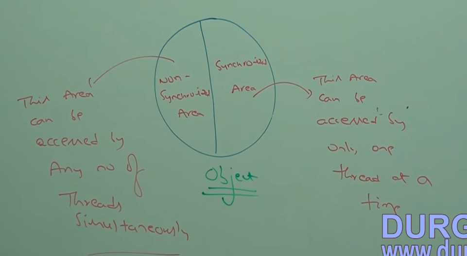
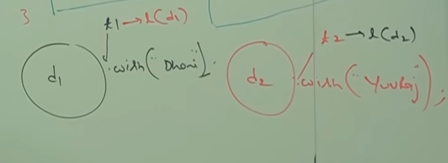
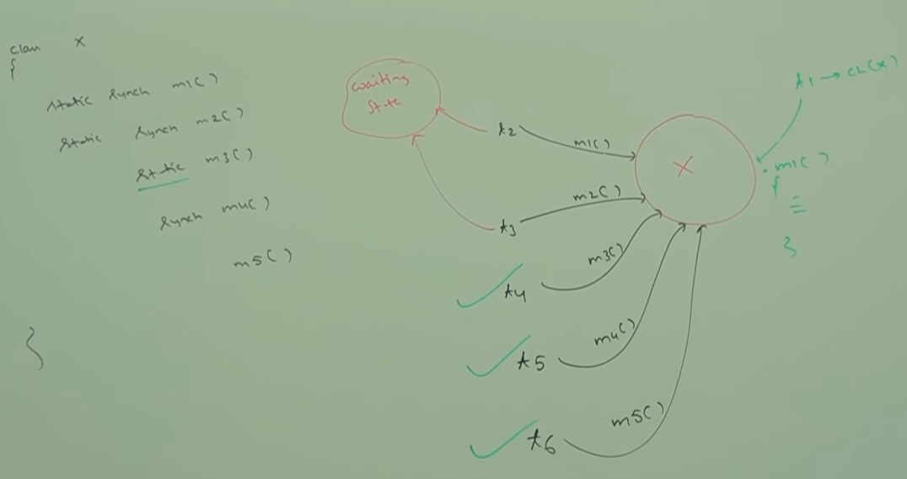

# Synchronization Introduction

## What is Synchronization?
- Synchronized is a modifier applicable only for methods and blocks but not for classes and variables.
- If multiple thread trying to operate simultaneously on the same object, then there may be a chance of data inconsistency problem. To overcome this problem we should go for "synchronized" keyword.
- If a method or block declared as synchronized, then at a time only one thread is allowed to execute that method or block on the given object, so that date inconsistency problem will be resolved.

---

## Advantage and Disadvantage of Synchronization
- The main advantage of "synchronized" keyword is we can resolve data inconsistency problems.
- Disadvantage of "synchronized" keyword is it increases waiting time of thread and creates performance problems. Hence, if there is no specific requirement then it is not recommended to use synchronized keyword.

---

# Lock
- Internally synchronization concept is implemented by using lock.
- Every object in java has a unique lock.
- Whenever we use "synchronized" keyword then only the lock concept will come into the picture.
- If a thread wants to execute synchronized method on the given object, first it has get lock of that object, once thread got the lock then it is allowed to execute any synchronized method on that object.
- Once method execution completes, automatically thread releases the lock.
- Acquiring and releasing lock internally taken care by JVM  and programmer not responsible for this activity.

---

# How multiple synchronized method in the same object works?
- While a thread is executing synchronized method on the given object, the remaining threads are not allowed to execute any synchronized method simultaneously on the same object.
- But remaining threads are allowed to execute non-synchronized methods simultaneously.
- Lock concept is implemented based on object but not based on the method.

---

# Synchronized area vs Non Synchronized area
- Synchronized area:
  - This area can be accessed by only one thread at a time.
  - Wherever we are performing update operation (add/update/delete) i.e. where state of object changing.
- Non Synchronized area:
  - This area can be accessed by any no of threads simultaneously.
  - Wherever object state won't be changed like read() operation.



---

# What happens when we use 2 different object with synchronized method?

``` java
public static void main(String[] args) {
        Display d1 = new Display();
        Display d2 = new Display();
        MyThread t1 = new MyThread(d1, "Dhoni");
        MyThread t2 = new MyThread(d2, "Virat");

        t1.start();
        t2.start();

    }
```


- Even though wish method is synchronized we will get irregular output because threads are operating on different Java Objects.
- If multiple threads are operating on same java object then synchronization is required. If multiple threads are operating on multiple java objects then synchronization is not required.
- Example:
  - If you and your wife doing transactions in same joint account, synchronization is required.
  - If you and your wife doing transactions in separate account, synchronization is not required.

# Static synchronized method
- A static synchronized method in Java is a synchronized method that is associated with a class rather than with an instance (object) of that class. 
- This means that the synchronization lock for a static synchronized method is on the class itself, not on a specific object instance.

## Purpose of Static Synchronized Methods
- Static synchronized methods are used when you need to synchronize access to shared resources at the class level. 
- This is useful in scenarios where shared resources are common to all instances of a class or are static variables that need synchronized access.

## How Static Synchronized Methods Work (important)
- When a static synchronized method is invoked, the synchronization lock is acquired on the Class object representing the class to which the method belongs. 
- This ensures that only one thread at a time can execute any static synchronized method for that class.
- If another thread tries to execute a static synchronized method from the same class while the lock is held, it must wait until the lock is released.

# What is Class level lock?
- Every class in java has a unique lock which is nothing but class level lock.
- When a thread requires class level lock?
  - If a thread want to execute a static synchronized method, then thread required class level lock.
  - Once thread got class level lock then it is allowed to execute any static synchronized method of that class.
  - Once method execution completes automatically thread releases the lock.

## Simultaneous method execution during Class level lock
- While a thread executing static synchronized method the remaining threads are not allowed to execute static synchronized method simultaneous of the class.
- But remaining threads are allowed to execute the following method simultaneously:
  - non-synchronized static method
  - synchronized instance methods
  - non-synchronized instance methods

## 2 Methods to acquire class level lock
1. Using the synchronized static method.
2. Using synchronized block.
- Reference: https://www.geeksforgeeks.org/class-level-lock-in-java/

