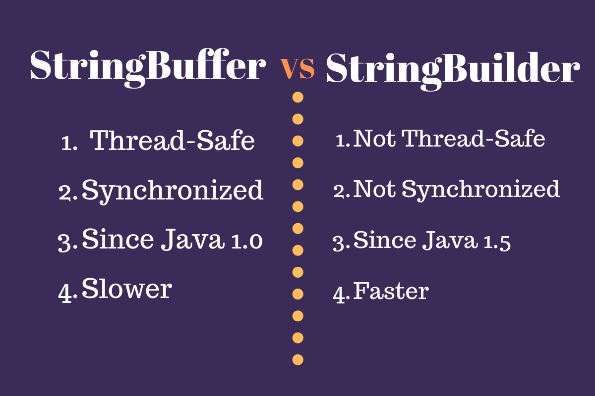
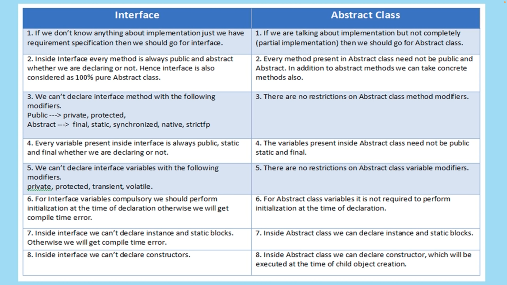
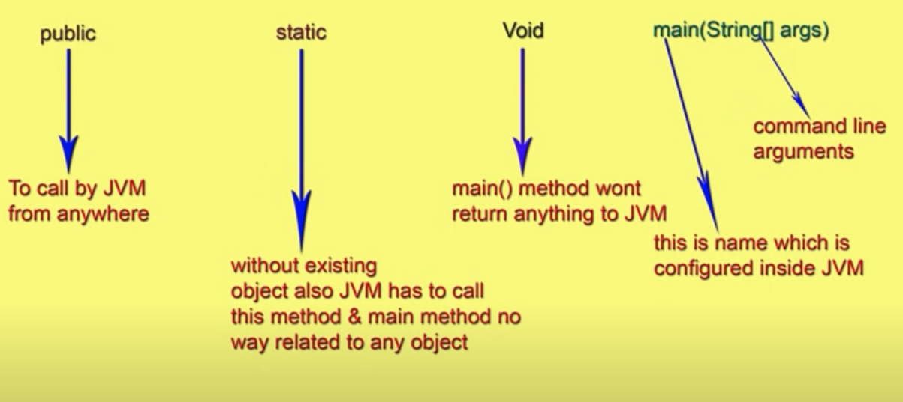

# final, finally, finalize

- **final**:
    - Keyword used to declare constants, variables, methods, and classes.
    - For variables, it indicates that the value cannot be changed once assigned.
    - For methods, it prevents overriding in subclasses.
    - For classes, it prevents inheritance.

- **finally**:
    - Block used in exception handling to ensure that certain code gets executed regardless of whether an exception is thrown or not.
    - Typically used to release resources like closing files or database connections.
    - Executes after the try block or after the catch block if an exception occurs.

- **finalize**:
    - Method called by the garbage collector before reclaiming the memory occupied by an object.
    - Deprecated in Java 9 due to its unreliable nature and unpredictability.
    - Not recommended for releasing non-memory resources like files or database connections; finally blocks are preferred for such purposes.

---

# instantiate String in two ways
``` java
String str = "ABC";
// or
String str = new String("ABC");
```

---

# String, StringBuffer, StringBuilder

**String:**
- Immutable sequence of characters in Java.
- Once created, cannot be modified.
- Any operation that appears to modify a String actually creates a new String object.
- Thread-safe due to its immutability.
- Suitable for scenarios where the content is static or doesn't change frequently.

**StringBuffer:**
- Mutable sequence of characters in Java.
- Can be modified after creation.
- Provides methods to append, insert, delete, and reverse content.
- Thread-safe, but has synchronized methods which can lead to performance overhead in multi-threaded environments.
- Suitable for multi-threaded scenarios where dynamic string manipulation is required.

**StringBuilder:**
- Similar to StringBuffer, but not synchronized.
- Mutable sequence of characters in Java.
- Can be modified after creation.
- Provides methods to append, insert, delete, and reverse content.
- Not thread-safe, but faster than StringBuffer due to lack of synchronization.
- Suitable for single-threaded scenarios where dynamic string manipulation is required and thread safety is not a concern.

**Difference:**
- **Mutability:** String is immutable, while StringBuffer and StringBuilder are mutable.
- **Synchronization:** StringBuffer is synchronized, ensuring thread safety, while StringBuilder is not.
- **Performance:** StringBuilder is faster than StringBuffer due to lack of synchronization, but StringBuffer is safer in multi-threaded environments.
- **Usage:** Use String when content is static, StringBuffer when thread safety is required, and StringBuilder when performance is a priority in single-threaded scenarios.



---

# Difference between "== operator" and "equals() method" in java?


- **`==` Operator**:
  - Compares memory addresses of objects.
  - Checks if two references point to the same instance.
  - For primitive types, compares their actual values.

- **`equals()` Method**:
  - Compares the contents (values) of objects.
  - Checks if two objects have the same content.
  - Can be overridden to provide custom equality semantics.

Example:
```java
String str1 = "hello";
String str2 = "hello";
System.out.println(str1 == str2); // Output: true (because of String pool)
System.out.println(str1.equals(str2)); // Output: true (because both strings have the same content)
```

# What are the various modifiers available in java ?
- `public`: Accessible from any other class.
- `protected`: Accessible within the same package or subclasses.
- `private`: Accessible only within the same class.
- `final`: Variable's value cannot be changed, method cannot be overridden, or class cannot be subclassed.
- `static`: Variable or method belongs to the class rather than any instance of the class.
- `abstract`: Class or method is incomplete and must be implemented by subclasses.
- `synchronized`: Ensures only one thread can access a block of code or method at a time.
- `volatile`: Variable may be modified asynchronously by multiple threads.
- `transient`: Variable should not be serialized when its containing object is serialized.
- `native`: Method is implemented in native code using JNI (Java Native Interface).
- `strictfp`: Ensures consistent floating-point arithmetic across different platforms.

---

# Access Specifiers vs Access Modifiers

- In old languages like C++ public, private, protected, default are considered as Access Specifiers. Except this the remaining (like static) are considered as Access Modifiers.
- But in java there is no terminology like specifiers. all are by default considered as modifiers only.
  - public, private, protected, default, final, static, synchronized, abstract, native, strictfp, transient, volatile

---

# Interface vs Abstract Class vs Concrete Class

**Interface**:
- Blueprint of a class, defining a set of abstract methods and constants.
- Supports multiple inheritance; a class can implement multiple interfaces.
- Cannot contain method implementations or instance variables until Java 8 (with default and static methods).
- Used for defining contracts and achieving abstraction.
- Interfaces are implemented using the `interface` keyword.

**Abstract Class**:
- Class that cannot be instantiated on its own, designed to be subclassed.
- May contain both abstract and concrete methods.
- Can have constructors, fields, and implemented methods, as well as abstract methods.
- Subclasses must provide implementations for all abstract methods unless declared abstract.
- Used for providing a partial implementation and defining common behavior.
- Abstract classes are declared using the `abstract` keyword.

**Concrete Class**:
- Regular class that can be instantiated directly.
- Provides implementations for all its methods, including any inherited abstract methods.
- Can be subclassed further to provide additional functionality or override existing methods.
- Does not require subclasses to provide implementations for any methods.
- Used for creating objects and providing full functionality.
- Concrete classes are simply defined using the `class` keyword.

---

# Explain about System.out.println();

Certainly! Here's an explanation of `System.out.println();`:

- **System**: `System` is a class in Java's `java.lang` package that provides access to the standard input, output, and error streams, among other system-related functionality.

- **out**: `out` is a static field within the `System` class representing the standard output stream, typically connected to the console or terminal where the output of a Java program is displayed.

- **println()**: `println()` is a method of the `PrintStream` class, which is the type of `System.out`. It is used to print a line of text to the standard output stream, followed by a newline character `\n`. This method automatically flushes the stream after printing.

- **Usage**: `System.out.println();` is commonly used in Java to print text, variables, or other data to the console during program execution. It accepts various types of arguments, including strings, numbers, and objects, and converts them to their string representations before printing.

- **Example**:
  ```java
  int number = 10;
  String message = "Hello, world!";
  System.out.println(number); // Prints the value of 'number' followed by a newline
  System.out.println(message); // Prints the value of 'message' followed by a newline
  ```

---

# Difference between Interface and Absract Class



---

# Explain about public static void main(String[] args);



The above syntax is very strict if we perform any change we will get runtime exception saying NoSuchMethodError:main. However, below changes are accepted:

- The order of modifiers is not important that is instead of "public static" we can take "static public" also.
- We can declare "string[]" in any acceptable form
  - main(String[] args)
  - main(String []args)
  - main(String args[])
- instead of 'args' we can take any valid java identifier.
- we can replace String[] with var arg parameter
  - main(String[] args) ==> main(String... args)
- We can declare main() method with the following modifiers also:
  - final, synchronized, strictfp
- The below code will perfectly work:
  ```java
    class Test{
      final static synchronized strictfp public void main(String... sanjay){
        System.out.print("hey");
      }
    }
  ```
  
# public static void main():Overloading, inheritance, overriding & method hiding

## Case 1:
- Overloading of the main method is possible but JVM will always call String[] argument main method only.
- The other overloaded method we have to call explicitly then it will ve executed just a normal method call. 
  ```java
    class Test{
      public static void main(String[] args){
        System.out.print("hey"); //this will be called.
      }
      public static void main(int[] args){
        System.out.print("hello");
      }
    }
  ```
## Case 2:
- Inheritance concept applicable for the main method. Hench while executing child class if child class doesn't contain main method then parent class main method will be executed.
## Case 3:
- It seems overriding concept applicable for main method but it is not overriding it is method hiding.
- **Method Hiding:** In method hiding, a subclass defines a static method with the same name and signature as a static method in its superclass. 
  - Behavior:
    - **Static Context:** Method hiding occurs in a static context, where static methods are involved.
    - **Compile-Time Decision:** Method hiding is determined at compile time based on the reference type, not the actual object type.
    - **Reference Type:** The static method invoked depends on the reference type, not the actual object type.
    - **No Polymorphism:** Method hiding does not follow polymorphic behavior like instance method overriding.
  - Comparison with Method Overriding:
    - **Method Overriding:** In method overriding, a subclass provides a specific implementation of an instance method defined in its superclass. It applies to instance methods, not static methods.
    - **Polymorphism:** Method overriding follows polymorphic behavior, where the actual method invoked is determined by the actual object type at runtime.
    - **Dynamic Binding:** Method overriding involves dynamic binding, where the method to be executed is determined dynamically based on the object type.
    - **Inheritance Relationship:** Method overriding is applicable to instance methods and maintains the inheritance relationship between classes.

# public static void main(): 1.7 version Enhancements

- Until 1.6 version if the class doesn't contain main() method then we will get runtime exception saying no such method error. But from 1.7 version onwards instead of NoSuchMethodError we will ger more meaningful error information.
- **static block**:
  - Prior to version 1.6, running a Java program without a `main()` method but containing a static block would result in the execution of the static block, followed by an error indicating that the `main` method was not found.
  - From version 1.7 onwards, even if a class contains static blocks, they will not be executed if the class does not contain a `main()` method.
- Will compilation happen without a main() method in Java? If yes, what error will it throw?
  - Yes, compilation will occur even if the class does not contain a main() method. However, when attempting to run the compiled class file, if it lacks a main() method, an error like "Error: Main method not found in class <class_name>, please define the main method as: public static void main(String[] args)" will be encountered.
- If the class contains main() method whether it is 1.6 or 1.7 version there is no change in execution sequence.
- ``` java
  class Test{
    static{
      System.out.println("static block")
    }
    public static void main(String[] args){
      System.out.println("main method")
    }
  ```
  ``` text
  //output: 1.6 version
  static block
  main method
  //output: 1.7 version
  static block
  main method
  ```

---

# What is identifier in java?

- **Definition:** An identifier in Java is a sequence of characters used to uniquely identify a variable, method, class, or other program element.
- **Purpose:** Identifiers serve as the names for program elements, allowing developers to refer to them within the code.
- **Rules and Conventions:**
  - Case-sensitive: Uppercase and lowercase letters are distinct in identifiers.
  - Cannot be Java keywords or reserved words.
  - Should follow naming conventions for readability and maintainability.
- **Examples:**
  - Variable names: `myVariable`, `totalAmount`
  - Method names: `calculateTotal`, `printMessage`
  - Class names: `MyClass`, `StudentDetails`

---

# Difference between overriding and overloading.

| Property                    | Overriding                                                                                                                         | Overloading                                                       |
|-----------------------------|------------------------------------------------------------------------------------------------------------------------------------|-------------------------------------------------------------------|
| Method Name                 | Must have the same method name as the superclass                                                                                   | Must have a same method name within the same class                |
| Argument Types              | Must have the same number and types of parameters                                                                                  | Must have a different number or types of parameters               |
| Signature                   | Method signature (name and argument types) must match                                                                              | Method signature should differ (name or argument types)           |
| Return Type                 | Must have the same return type                                                                                                     | May have different return types                                   |
| Private/Static/Final Method | Can't override private, static, or final methods                                                                                   | Method overloading can involve private, static, or final methods. |
| Access Modifier             | Must have the same or wider access modifier (if super class method is protected, child class method should be protected or public) | No restrictions on access modifiers                               |
| Throws Clause               | Must not throw new or broader checked exceptions                                                                                   | Can throw new or narrower checked exceptions                      |
| Method Resolution           | Resolved at runtime based on object's actual type                                                                                  | Resolved at compile time based on method signature                |
| Also Known As               | Runtime Polymorphism, Dynamic Method Dispatch                                                                                      | Compile-time Polymorphism, Static Method Binding                  |

---

# Difference between Parent p = new Child(); and Child c = new Child();

| Property                   | Parent p = new Child();                                                       | Child c = new Child();                                                   |
|----------------------------|-------------------------------------------------------------------------------|--------------------------------------------------------------------------|
| When to Use                | If we don't know exact runtime type of object then we should us this approach | If we know exact runtime type of object then we should use this approach |
| Type of reference variable | Parent                                                                        | Child                                                                    |
| Type of object created     | Child                                                                         | Child                                                                    |
| Method calls               | Only methods defined in the Parent class                                      | All methods defined in the Child class                                   |
| Access to Child-specific   | Limited to methods and fields accessible through the Parent class             | Full access to all methods and fields specific to the Child class        |

---

# Various possible combinations of try catch finally

- Whenever we are writing try block compulsory we should write catch or finally i.e. 'try' without catch or finally is invalid syntax.
- Whenever we are writing catch block compulsory we should write try block i.e. catch without try is invalid.
- Whenever we are writing finally block compulsory we should write try block i.e. Finally without try is invalid.
- In try catch finally, order is important.
- Try with multiple catch block is valid but the order is important compulsory we should take from child to parent. By mistake if we take from parent to child then we will get compile time error.
- If we define two catch blocks for the same exception we will get compile time error.
- We can define try-catch-finally within the try, within the catch and within finally blocks. Hence nesting of try-catch-finally is valid.
- For try-catch-finally curly braces are mandatory.

# What is the difference between exception and error?

| Property                  | Exception                                           | Error                                                |
|---------------------------|-----------------------------------------------------|------------------------------------------------------|
| Type                      | Checked or Unchecked                                | Unchecked                                            |
| Cause                     | Generally caused by application code                | Generally caused by the environment or JVM           |
| Handling                  | Usually handled using try-catch blocks              | Often not handled, may result in program termination |
| Recovery                  | Possible with appropriate error handling mechanisms | May not be recoverable                               |
| Examples                  | IOException, NullPointerException                   | OutOfMemoryError, StackOverflowError                 |

# What the difference between Checked Exception and Unchecked Exception
Here's the difference between Checked Exception and Unchecked Exception presented in table format:

| Property                | Checked Exception                                  | Unchecked Exception                                                  |
|-------------------------|----------------------------------------------------|----------------------------------------------------------------------|
| Definition              | Subclass of Exception, must be handled or declared | Subclass of RuntimeException, not required to be handled or declared |
| Checked at Compile Time | Yes                                                | No                                                                   |
| JVM Handling            | Yes, compiler forces to handle or declare          | No, optional handling by developer                                   |
| Example                 | IOException, SQLException                          | NullPointerException, ArrayIndexOutOfBoundsException                 |
| Recovery                | Typically recoverable, requires handling           | Typically unrecoverable, often a programming error                   |