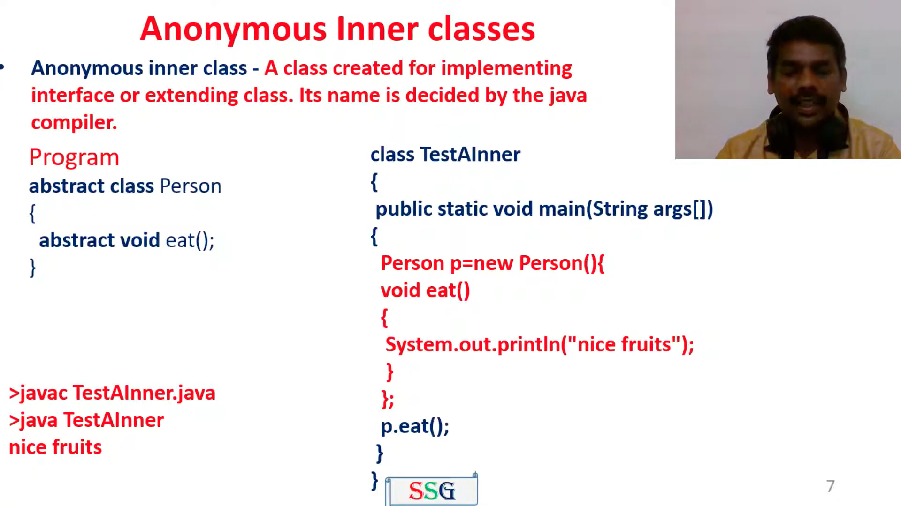
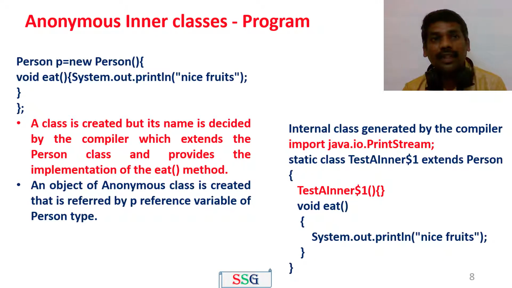

# 1. What is an abstract class ?
- **Cannot be instantiated:** Abstract classes cannot be instantiated directly, serving as blueprints for subclasses.
- **May contain abstract methods:** They may contain abstract methods, which subclasses must implement.
- **May contain concrete methods:** Abstract classes can also have concrete methods with default behavior.
- **May contain instance variables:** Instance variables, constructors, and other features common to regular classes are allowed.
- **Provides code reusability:** They promote code reusability by allowing common functionality to be shared. 
- **Designed for inheritance:** Abstract classes are designed for inheritance, defining common interfaces and behavior.
- **May enforce contracts:** They may enforce contracts by defining abstract methods that subclasses must implement.
- **Usage in polymorphism:** Abstract classes are often used in polymorphism, where a reference variable of the abstract class type can point to objects of its concrete subclasses.
- **Subclassing:** Subclasses of an abstract class must either provide implementations for all the abstract methods in the superclass or be declared as abstract themselves.
- **Keyword Usage:** Abstract classes are declared using the abstract keyword, while abstract methods are declared using both the abstract keyword and method signature.
- **Implementation:**
- ```java
    // Abstract class
     abstract class Shape {
         // Abstract method
         abstract void draw();
     }
        
     // Concrete subclass
     class Circle extends Shape {
         // Implementation of the abstract method
         void draw() {
             System.out.println("Drawing a circle");
         }
     }
        
     // Concrete subclass
     class Rectangle extends Shape {
         // Implementation of the abstract method
         void draw() {
             System.out.println("Drawing a rectangle");
         }
     }
        
     // Abstract subclass
     abstract class Triangle extends Shape {
     // No implementation of the abstract method
     }
        
     public class Main {
         public static void main(String[] args) {
             // Creating objects of concrete subclasses
             Shape circle = new Circle();
             Shape rectangle = new Rectangle();
        
             // Calling the draw method
             circle.draw(); // Output: Drawing a circle
             rectangle.draw(); // Output: Drawing a rectangle
        
             // Creating an object of an abstract subclass (not allowed)
             // Shape triangle = new Triangle(); // Error: Shape is abstract; cannot be instantiated
         }
     }
    ```
---
# 2. Is multiple inheritance supported in java or not?
- No, Java does not support multiple inheritance of classes.
- Java's single inheritance model was chosen to simplify the language and prevent the diamond problem.
- Multiple inheritance can lead to ambiguity in method resolution, especially with conflicting method implementations from different parent classes.
- Java allows multiple inheritance of interfaces, which are contracts for classes to implement, but this is not the same as inheriting implementation details.
- Through interfaces, Java achieves a form of multiple inheritance by allowing classes to implement multiple interfaces, promoting code reuse while avoiding the complexities of multiple class inheritance.
---
# 3. How do you define an abstract method?
An abstract method is defined using the abstract keyword in its method signature and lacks a method body. It serves as a placeholder within an abstract class, indicating that concrete subclasses must provide an implementation for this method. Abstract methods are declared like regular methods but end with a semicolon instead of curly braces. Here's an example:
```java
public abstract class Shape {
    // Abstract method declaration
    public abstract double area();
}
```
---
# 4. What is a coupling?
- In object-oriented design, Coupling refers to the degree of direct knowledge that one element has of another. In other words, how often do changes in class A force related changes in class B.
---
# 5. Difference between Encapsulation and Abstraction?
| Abstraction                                                                                                                        | Encapsulation                                                                                                                                                     |
|------------------------------------------------------------------------------------------------------------------------------------|-------------------------------------------------------------------------------------------------------------------------------------------------------------------|
| Abstraction focuses on the behavior and properties of objects without exposing their internal details.                             | Encapsulation involves bundling the data and methods that operate on the data into a single unit or class.                                                        |
| Abstraction hides the complex implementation details and provides a simplified view of an object's functionality.                  | Encapsulation hides the internal state of an object and restricts direct access to its data from outside the class.                                               |
| Abstraction emphasizes the conceptual representation of objects and their interactions in a system.                                | Encapsulation emphasizes data protection and security by controlling access to class members.                                                                     |
| Abstraction is achieved through abstract classes, interfaces, and inheritance hierarchies.                                         | Encapsulation is achieved by using access modifiers (e.g., private, public, protected) to control access to class members.                                        |
| Abstraction allows for code reusability and promotes modularity and maintainability in software design.                            | Encapsulation prevents external code from directly modifying the internal state of an object, reducing the risk of unintended side effects.                       |
| Abstraction enables polymorphism, allowing objects of different types to be treated uniformly through inheritance and interfaces.  | Encapsulation fosters information hiding, enabling classes to maintain a consistent interface while modifying their internal implementation.                      |
| Abstraction focuses on the "what" aspect of objects, defining their essential characteristics and behaviors.                       | Encapsulation focuses on the "how" aspect of objects, specifying how data is stored and manipulated within a class.                                               |
| Abstraction allows developers to create high-level, generic components that can be extended and customized for specific use cases. | Encapsulation promotes data integrity and helps maintain the consistency and integrity of an object's state.                                                      |
| Abstraction helps in managing complexity by providing a simplified view of complex systems and their interactions.                 | Encapsulation enhances security by preventing unauthorized access to sensitive data and ensuring that changes to the internal state are controlled and validated. |
| Abstraction facilitates communication between different parts of a system by defining clear interfaces and interactions.           | Encapsulation improves code readability and understandability by encapsulating related functionality and reducing dependencies between classes.                   |
---
# 6. What is a tightly coupled and give an example?
- In general, Tight coupling means the two classes often change together. In other words, if A knows more than it should about the way in which B was implemented, then A and B are tightly coupled.
- Example : If you want to change the skin, you would also have to change the design of your body as well because the two are joined together – they are tightly coupled. The best example of tight coupling is RMI(Remote Method Invocation).
- ``` java
  // Java program to illustrate
  // tight coupling concept
  class Subject {
      Topic t = new Topic();
      public void startReading(){
          t.understand();
      }
  }
  class Topic {
    public void understand(){
        System.out.println("Tight coupling concept");
    }
  }
  ```
- Explanation: In the above program the Subject class is dependents on Topic class. In the above program Subject class is tightly coupled with Topic class it means if any change in the Topic class requires Subject class to change. For example, if Topic class understand() method change to gotit() method then you have to change the startReading() method will call gotit() method instead of calling understand() method.
- ``` java
    // Java program to illustrate
    // tight coupling concept
    class Volume{
        public static void main(String args[]){
            Box b = new Box(5,5,5);
            System.out.println(b.volume);
        }
    }
    class Box{
        public int volume;
        Box(int length, int width, int height){
            this.volume = length * width * height;
        }
    }
    ```
- Output: `125` 
- Explanation: In the above example, there is a strong inter-dependency between both the classes. If there is any change in Box class then they reflects in the result of Class Volume.
---
# 7. What is a loosely coupled and give an example?
- In simple words, loose coupling means they are mostly independent. If the only knowledge that class A has about class B, is what class B has exposed through its interface, then class A and class B are said to be loosely coupled.
- In order to over come from the problems of tight coupling between objects, spring framework uses dependency injection mechanism with the help of POJO/POJI model and through dependency injection its possible to achieve loose coupling.
- Example : If you change your shirt, then you are not forced to change your body – when you can do that, then you have loose coupling. When you can’t do that, then you have tight coupling. The examples of Loose coupling are Interface, JMS.
- ```java
    // Java program to illustrate 
    // loose coupling concept
    public interface Topic {
        void understand();
    }
    class Topic1 implements Topic {
        public void understand() {
            System.out.println("Got it");
        }
    } 
    class Topic2 implements Topic {
        public void understand() {
            System.out.println("understand");
        }
    } 
    public class Subject {
        public static void main(String[] args) {
        Topic t = new Topic1();
        t.understand();
        }
    }
  ```
- Explanation : In the above example, Topic1 and Topic2 objects are loosely coupled. It means Topic is an interface and we can inject any of the implemented classes at run time and we can provide service to the end user.
---
# 8. What is a default Constructor?
- A default constructor in Java is created automatically by the online Java compiler when the programmer doesn't create any constructor in the entire program.
- It is created to assign the default values to the instance variables of the class when an object is created.
- Default constructors are sometimes called no-arg constructors since they both work the same. But no-arg constructor is created by the user while default constructor can only be created by the compiler.
---
# 9. What is inner or nested class?
- Java inner class or nested class is a class which is declared inside the class or interface.
- It can access all the members of the outer class including private data members and methods.
- Nested classes are used to develop more readable and maintainable code because it logically group classes and interfaces in one place only.
---
# 10. Types of Inner Class?
- Non-static nested class(inner class)
  - Member inner class
    - A class created within class and outside method.
    - A non-static class that is created inside a class but outside a method is called member inner class.
  - Anonymous inner class 
    - A class created for implementing interface or extending class. Its name is decided by java compiler.
    - 
    - 
  - Local inner class
    - A class created within method.
    - If you want to invoke the method of local inner class, you must instantiate this class inside the method.
- Static nested class 
  - A satic class created within class. 
  - It cannot access non-static data member and methods.
  - It can access static data members of outer class including private.
---
# 9. Can you create an inner class inside a method?

# 10. What is the anonymous inner class?
# 11. What is the function Overloading?
# 12. What is the method Overloading?
# 13. What is the nested class?
https://docs.oracle.com/javase/tutorial/java/javaOO/nested.html
# 14. How do you call a super class constructor from a constructor?
# 15. Is a super class constructor called even when there is no explicit call from a sub class constructor?
# 16. How to call the super class parameterized constructor?
# 17. Can a constructor be called directly from a method?
# 18. How do you define an Interface?
# 19. Can you tell a little bit more about interfaces? 
# 20. What is default class modifier?
21. What is an interface?
22. Another class in same package:Has access to default class?
23. How do you implement an interface?
24. class in different package:No access to default class?
25. What are the diff method access specifier?
26. Can you extend other interface?
27. What is a private access specifier and give the scope?
28. What is the public access specifier and give an example?
29. What is the default access specifier and give an example?
30. What is the protected access specifier and give an example?
31. What is the final method and give an example?
32. What is a final variable?
33. What is the final argument?
34. What is a static variable and methods give an example?
35. What are variable arguments or varargs?
36. Can you explain garbage Collection with an example?
37. What are best practices on garbage collection?
38. What are Initialization blocks? 
39. How to find the super class of the class in java? 
40. How to find,How many interfaces was implemented by the particular class?
41. When garbage collection run?
42. What are regular Expressions?
43. What is string Tokenizing?
44. can you give an example of string tokenizing?
45. How you can tokenize using scanner class?
46. How do you add hours to a date Object?
47. How do you format Date Objects?
48. How do you get Instance of Calendar class in java?