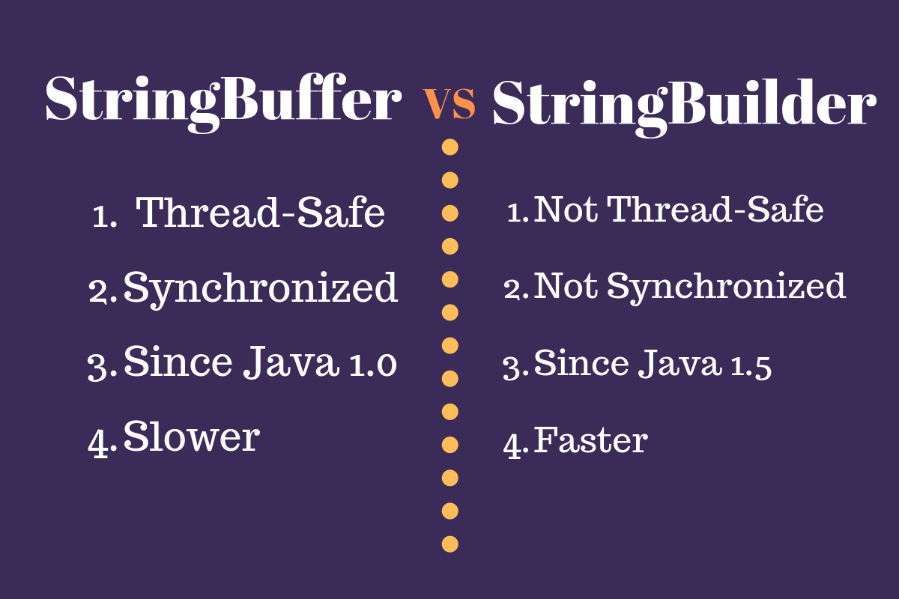
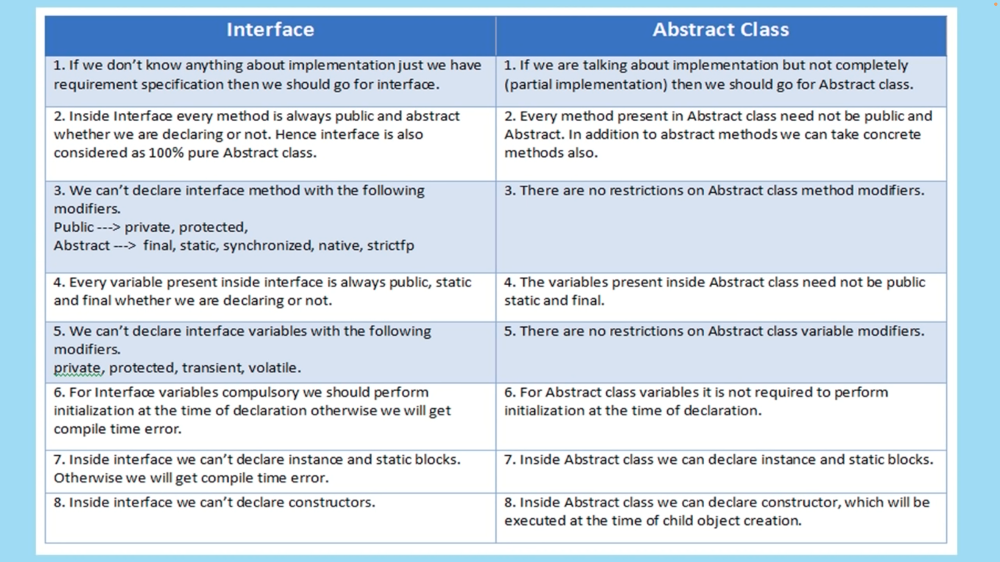
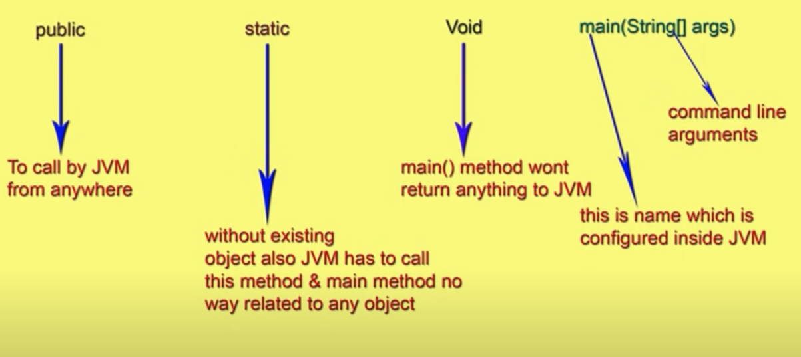

# final, finally, finalize

- **final**:
    - Keyword used to declare constants, variables, methods, and classes.
    - For variables, it indicates that the value cannot be changed once assigned.
    - For methods, it prevents overriding in subclasses.
    - For classes, it prevents inheritance.

- **finally**:
    - Block used in exception handling to ensure that certain code gets executed regardless of whether an exception is thrown or not.
    - Typically used to release resources like closing files or database connections.
    - Executes after the try block or after the catch block if an exception occurs.

- **finalize**:
    - Method called by the garbage collector before reclaiming the memory occupied by an object.
    - Deprecated in Java 9 due to its unreliable nature and unpredictability.
    - Not recommended for releasing non-memory resources like files or database connections; finally blocks are preferred for such purposes.

---

# instantiate String in two ways
``` java
String str = "ABC";
// or
String str = new String("ABC");
```

---

# String, StringBuffer, StringBuilder

**String:**
- Immutable sequence of characters in Java.
- Once created, cannot be modified.
- Any operation that appears to modify a String actually creates a new String object.
- Thread-safe due to its immutability.
- Suitable for scenarios where the content is static or doesn't change frequently.

**StringBuffer:**
- Mutable sequence of characters in Java.
- Can be modified after creation.
- Provides methods to append, insert, delete, and reverse content.
- Thread-safe, but has synchronized methods which can lead to performance overhead in multi-threaded environments.
- Suitable for multi-threaded scenarios where dynamic string manipulation is required.

**StringBuilder:**
- Similar to StringBuffer, but not synchronized.
- Mutable sequence of characters in Java.
- Can be modified after creation.
- Provides methods to append, insert, delete, and reverse content.
- Not thread-safe, but faster than StringBuffer due to lack of synchronization.
- Suitable for single-threaded scenarios where dynamic string manipulation is required and thread safety is not a concern.

**Difference:**
- **Mutability:** String is immutable, while StringBuffer and StringBuilder are mutable.
- **Synchronization:** StringBuffer is synchronized, ensuring thread safety, while StringBuilder is not.
- **Performance:** StringBuilder is faster than StringBuffer due to lack of synchronization, but StringBuffer is safer in multi-threaded environments.
- **Usage:** Use String when content is static, StringBuffer when thread safety is required, and StringBuilder when performance is a priority in single-threaded scenarios.



---

# Difference between "== operator" and "equals() method" in java?


- **`==` Operator**:
  - Compares memory addresses of objects.
  - Checks if two references point to the same instance.
  - For primitive types, compares their actual values.

- **`equals()` Method**:
  - Compares the contents (values) of objects.
  - Checks if two objects have the same content.
  - Can be overridden to provide custom equality semantics.

Example:
```java
String str1 = "hello";
String str2 = "hello";
System.out.println(str1 == str2); // Output: true (because of String pool)
System.out.println(str1.equals(str2)); // Output: true (because both strings have the same content)
```

# What are the various modifiers available in java ?
- `public`: Accessible from any other class.
- `protected`: Accessible within the same package or subclasses.
- `private`: Accessible only within the same class.
- `final`: Variable's value cannot be changed, method cannot be overridden, or class cannot be subclassed.
- `static`: Variable or method belongs to the class rather than any instance of the class.
- `abstract`: Class or method is incomplete and must be implemented by subclasses.
- `synchronized`: Ensures only one thread can access a block of code or method at a time.
- `volatile`: Variable may be modified asynchronously by multiple threads.
- `transient`: Variable should not be serialized when its containing object is serialized.
- `native`: Method is implemented in native code using JNI (Java Native Interface).
- `strictfp`: Ensures consistent floating-point arithmetic across different platforms.

---

# Access Specifiers vs Access Modifiers

- In old languages like C++ public, private, protected, default are considered as Access Specifiers. Except this the remaining (like static) are considered as Access Modifiers.
- But in java there is no terminology like specifiers. all are by default considered as modifiers only.
  - public, private, protected, default, final, static, synchronized, abstract, native, strictfp, transient, volatile

---

# Interface vs Abstract Class vs Concrete Class

**Interface**:
- Blueprint of a class, defining a set of abstract methods and constants.
- Supports multiple inheritance; a class can implement multiple interfaces.
- Cannot contain method implementations or instance variables until Java 8 (with default and static methods).
- Used for defining contracts and achieving abstraction.
- Interfaces are implemented using the `interface` keyword.

**Abstract Class**:
- Class that cannot be instantiated on its own, designed to be subclassed.
- May contain both abstract and concrete methods.
- Can have constructors, fields, and implemented methods, as well as abstract methods.
- Subclasses must provide implementations for all abstract methods unless declared abstract.
- Used for providing a partial implementation and defining common behavior.
- Abstract classes are declared using the `abstract` keyword.

**Concrete Class**:
- Regular class that can be instantiated directly.
- Provides implementations for all its methods, including any inherited abstract methods.
- Can be subclassed further to provide additional functionality or override existing methods.
- Does not require subclasses to provide implementations for any methods.
- Used for creating objects and providing full functionality.
- Concrete classes are simply defined using the `class` keyword.

---

# Explain about System.out.println();

Certainly! Here's an explanation of `System.out.println();`:

- **System**: `System` is a class in Java's `java.lang` package that provides access to the standard input, output, and error streams, among other system-related functionality.

- **out**: `out` is a static field within the `System` class representing the standard output stream, typically connected to the console or terminal where the output of a Java program is displayed.

- **println()**: `println()` is a method of the `PrintStream` class, which is the type of `System.out`. It is used to print a line of text to the standard output stream, followed by a newline character `\n`. This method automatically flushes the stream after printing.

- **Usage**: `System.out.println();` is commonly used in Java to print text, variables, or other data to the console during program execution. It accepts various types of arguments, including strings, numbers, and objects, and converts them to their string representations before printing.

- **Example**:
  ```java
  int number = 10;
  String message = "Hello, world!";
  System.out.println(number); // Prints the value of 'number' followed by a newline
  System.out.println(message); // Prints the value of 'message' followed by a newline
  ```

---

# Difference between Interface and Absract Class



---

# Explain about public static void main(String[] args);



The above syntax is very strict if we perform any change we will get runtime exception saying NoSuchMethodError:main. However, below changes are accepted:

- The order of modifiers is not important that is instead of "public static" we can take "static public" also.
- We can declare "string[]" in any acceptable form
  - main(String[] args)
  - main(String []args)
  - main(String args[])
- instead of 'args' we can take any valid java identifier.
- we can replace String[] with var arg parameter
  - main(String[] args) ==> main(String... args)
- We can declare main() method with the following modifiers also:
  - final, synchronized, strictfp
- The below code will perfectly work:
  ```java
    class Test{
      final static synchronized strictfp public void mian(String... sanjay){
        System.out.print("hey");
      }
    }
  ```
---

# What is identifier in java?


